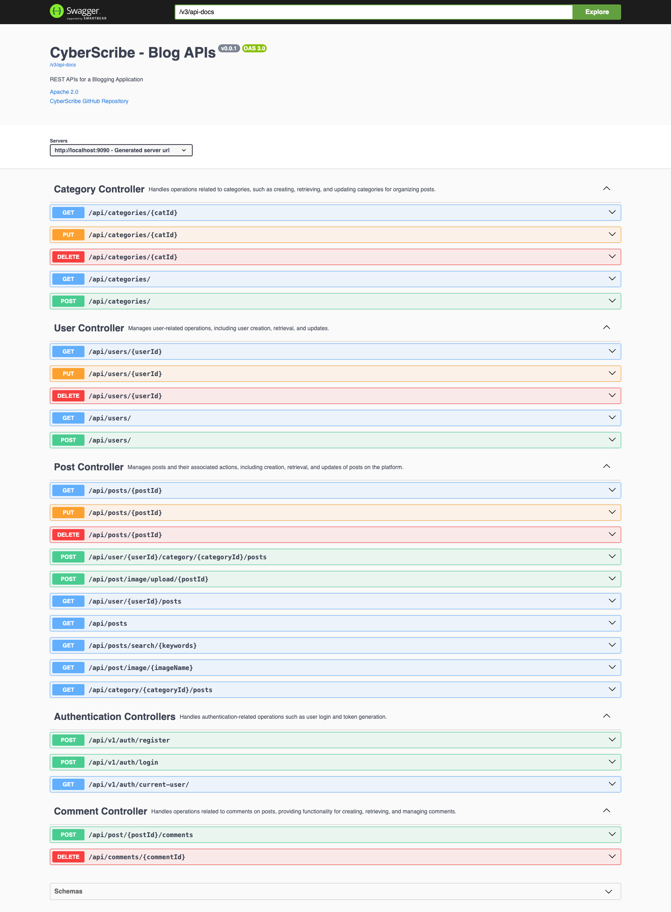

# 🚀 CyberScribe 🖋️

Welcome to CyberScribe! The ultimate Blogging Application API project, where creativity meets technology. 🌐✨

## 📖 Introduction

Dive into the world of seamless blogging with CyberScribe API! Empowering developers to effortlessly integrate and interact with a dynamic blogging platform. Whether you're crafting a mesmerizing frontend, a dazzling mobile app, or any other client, CyberScribe APIs have got your back for managing all your blog-related activities.

## Swagger Docs

## ✨ Features

- **Authentication:**
  - Authenticate users and generate JWT tokens 🛡️
  - Register new users 📝

- **Category Management:**
  - Create, retrieve, update, and delete blog categories 🗂️

- **Comment Management:**
  - Add comments to blog posts 💬
  - Retrieve, update, and delete comments 🗑️

- **Post Management:**
  - Create, retrieve, update, and delete blog posts 📝🔄
  - Associate posts with categories and users 🤝
  - View posts by user, category, or search by keywords 🔍
  - Upload and serve post images 🌅
  - Delete, update, and retrieve post details 📌

- **User Management:**
  - Create, update, and delete users 👤
  - Retrieve user details, including the currently logged-in user 🕵️

## 🚀 API Endpoints

### Authentication
- `POST /api/v1/auth/login`: Authenticate a user and generate JWT token 🔑
- `POST /api/v1/auth/register`: Register a new user 📝
- `GET /api/v1/auth/current-user`: Get details of the currently logged-in user 👤

### Categories
- `GET /api/v1/categories`: Get all categories 🗂️
- `POST /api/v1/categories`: Create a new category ➕
- `GET /api/v1/categories/{categoryId}`: Get details of a specific category 📌
- `PUT /api/v1/categories/{categoryId}`: Update a category 🔄
- `DELETE /api/v1/categories/{categoryId}`: Delete a category 🗑️

### Comments
- `POST /api/v1/post/{postId}/comments`: Create a comment for a specific post 💬
- `DELETE /api/v1/comments/{commentId}`: Delete a comment 🗑️

### Posts
- `POST /api/v1/user/{userId}/category/{categoryId}/posts`: Create a new post for a user and category 📝
- `GET /api/v1/user/{userId}/posts`: Get posts by user 👤
- `GET /api/v1/category/{categoryId}/posts`: Get posts by category 🗂️
- `GET /api/v1/posts`: Get all posts with pagination and sorting options 📃
- `GET /api/v1/posts/{postId}`: Get details of a specific post 📌
- `DELETE /api/v1/posts/{postId}`: Delete a post 🗑️
- `PUT /api/v1/posts/{postId}`: Update a post 🔄
- `GET /api/v1/posts/search/{keywords}`: Search posts by keywords 🔍
- `POST /api/v1/post/image/upload/{postId}`: Upload post image 🌅
- `GET /api/v1/post/image/{imageName}`: Serve post images 🖼️

### Users
- `POST /api/v1/users`: Create a new user 📝
- `PUT /api/v1/users/{userId}`: Update a user 🔄
- `DELETE /api/v1/users/{userId}`: Delete a user (admin only) 🗑️
- `GET /api/v1/users`: Get all users 👥
- `GET /api/v1/users/{userId}`: Get details of a specific user 👤

## 💻 Usage

To harness the power of these APIs, make HTTP requests to the specified endpoints using the appropriate methods (GET, POST, PUT, DELETE). Don't forget your authentication tokens!

Certainly! For a Spring Boot project in IntelliJ, the steps would be different. Here's the modified installation section:

## 🛠️ Installation

1. **Clone the repository:** 
   - Open IntelliJ IDEA and choose "Checkout from Version Control" > "Git".
   - Enter your Git repository URL and click "Clone."

2. **Import the project in IntelliJ IDEA:**
   - Open IntelliJ IDEA.
   - Choose "File" > "Open" and select the cloned project directory.

3. **Build the project:**
   - IntelliJ IDEA will automatically detect the project's build file (e.g., `pom.xml` for Maven).
   - Click "Build" > "Build Project" to download dependencies and build the project.

4. **Configure application properties:**
   - If your application relies on external configurations or properties, configure them in the `application.properties` or `application.yml` file. For example, database connection details.

5. **Run the application:**
   - Find the main class that contains the `main` method (usually annotated with `@SpringBootApplication`).
   - Right-click on the class and choose "Run" to start the Spring Boot application.

6. **Verify the application:**
   - Open a web browser and go to `http://localhost:8080` (or the port specified in your application). You should see the application running.

7. **Explore APIs:**
   - Use tools like Postman or Swagger UI to explore and test the available APIs.

**Note:** Ensure you have a compatible JDK installed on your system, and IntelliJ IDEA is configured to use that JDK.

## 🤝 Contributing

We welcome contributions from the community. If you find a bug or have an enhancement in mind, please open an issue or submit a pull request.

## 📄 License

This project is licensed under the [MIT License](LICENSE). Feel free to unleash your creativity!
